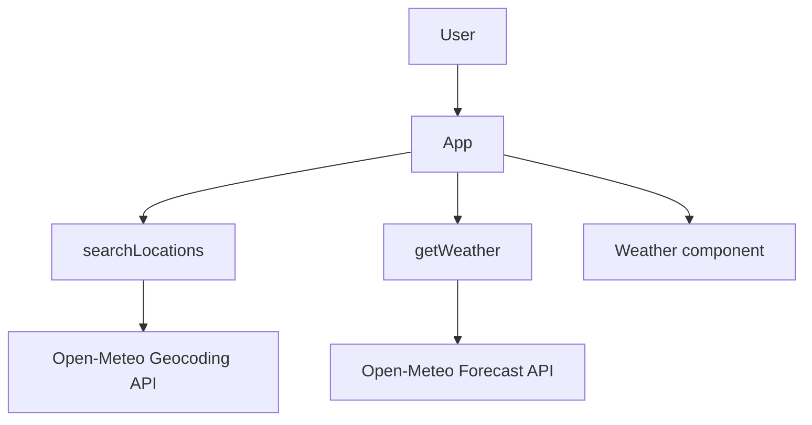
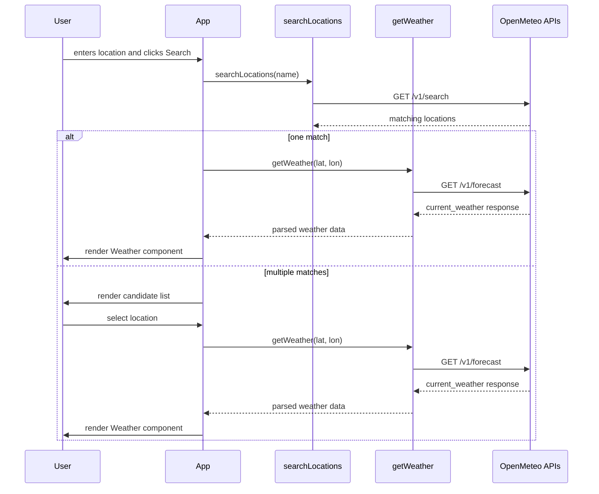

# dpe-demo

[](https://github.com/davidpayne-au/web-play/actions/workflows/deploy.yml)

This repository is a minimal weather app (Vite + React + TypeScript) that uses Open-Meteo geocoding and forecast APIs.

Requirements

- Node.js 24+

Getting started

1. Install dependencies:

```bash
npm install
```

2. Run the dev server:

```bash
npm run dev
```

3. Run lint (zero warnings allowed):

```bash
npm run lint
```

4. Run unit tests (single run):

```bash
npm run test
```

5. Build for production:

```bash
npm run build
```

6. Run Playwright E2E tests:

```bash
npm run test:e2e
```

7. Open Playwright UI mode:

```bash
npm run test:e2e:ui
```

8. Run the full verification cycle (lint + test + build + e2e):

```bash
npm run test:all
```

9. Preview the production build locally:

```bash
npm run preview
```

Note: `npm run test` runs Vitest once and exits.

E2E tests include accessibility checks powered by axe.

Set these env vars to override defaults (optional):

- `VITE_WEATHER_API_BASE`
- `VITE_GEOCODING_API_BASE`
- `VITE_WEATHER_API_KEY`

Files of interest:

- [src/App.tsx](src/App.tsx) — UI and example usage
- [src/api/weather.ts](src/api/weather.ts) — geocoding + weather client
- [src/api/weather.test.ts](src/api/weather.test.ts) — unit tests (Vitest)
- [.github/copilot-instructions.md](.github/copilot-instructions.md) — workspace agent hints

## Architecture



## Data Flow


